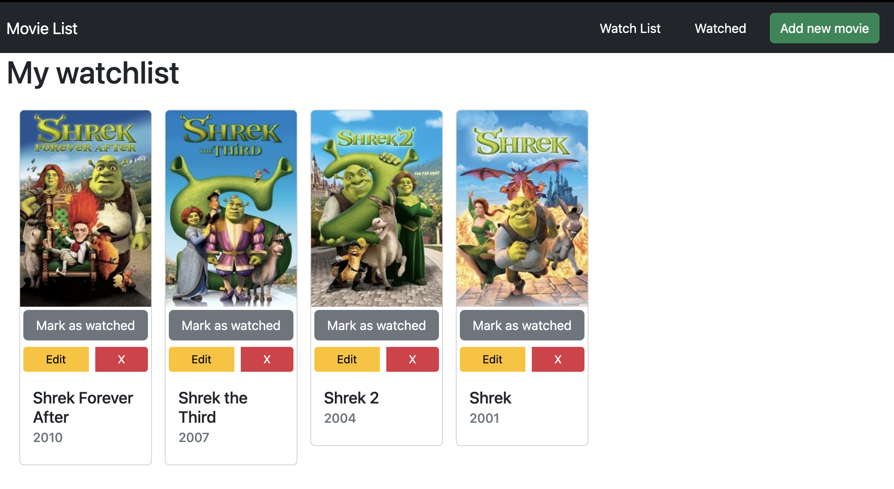

# MoviesList

 

## Welcome! 👋

This is Movie List App, that lets you manage your movies.

## Features

In this app you can manage moviest you can create list of moviest to watch and mark as watched after watching by performing CRUD operations.
You can search, add, delete and modify movies. Movies are fetched from https://www.themoviedb.org/, and data is stored via localStorage, using context.

## Tools used

- React
  - Vite
  - React-Bootstrap
  - Context
- [TMDB Api](https://www.themoviedb.org/)

## Live app :tada:

- [App live on Netlify](https://graceful-chaja-1934fd.netlify.app/)
